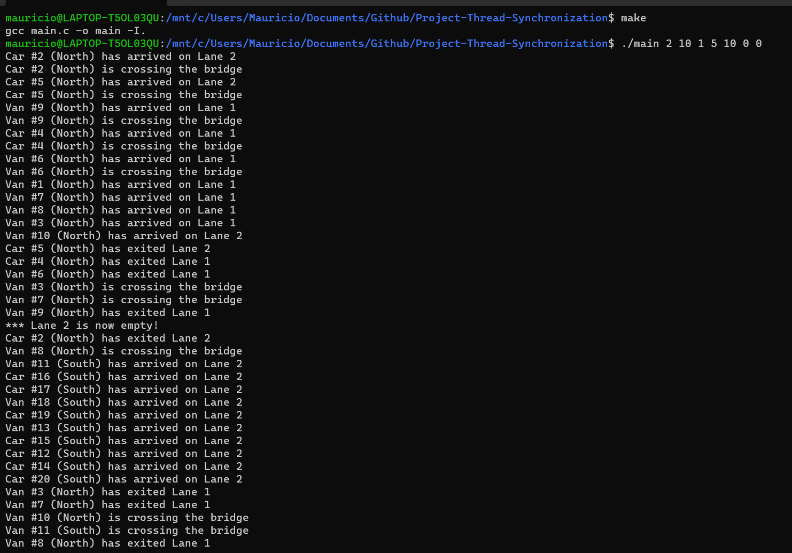
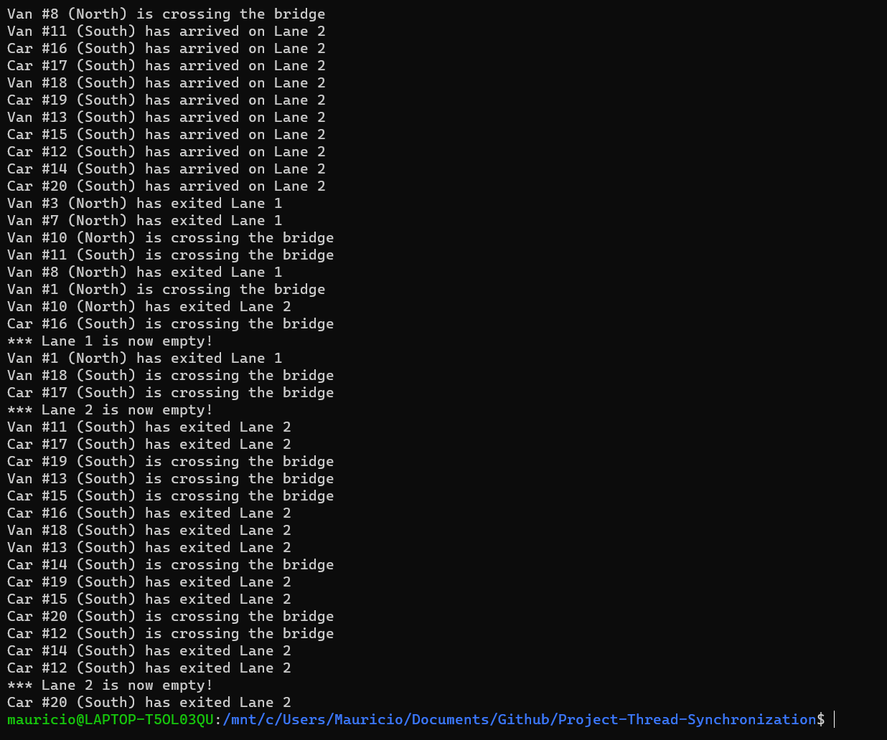

# Project-Thread-Synchronization
A multithreaded C program that simulates a bridge with two lanes, using pthreads.h. Created for ICS 460 - Operating Systems.

## How to run the program
The program is run by calling "make". The makefile must be in the directory.

## How to enter information via the user interface
Entering inputs via terminal loop. Enter ```./main``` and follow terminal prompts.

Entering inputs as program arguments. They can be entered in the form:

```./main <number of groups> <number of vehicles in group 1 (INTEGER)> <percent of north/south vehicles as a decimal (FLOAT)> <delay in seconds(INTEGER)> ... ```

## Demonstration



## Problems with the implementation
There were several features that I was not able to implement correctly.

Sometimes, in cases where vehicles are waiting for a lane to clear out, the wrong lock is called and results in a thread that wakes up and does not call any other threads before going back to sleep. I believe that I attempted to use too many locks and did not account for a thread to be called when it is not able to be active. I made a distinction between a thread that makes a motion to clear out a lane, and a lane that is waiting on a closed lane to clear out. I believe the inactivity occurs because of this. The main thread attempts to join a thread which never wakes up. Since the main thread must wait for all other threads to join before exiting, this is inebitable.

 I also was not able to implement a linked list. I made several attempts, but encountered a series of segmentation fault errors when attempting to implement a removeNode() method. In particular, I was not able to remove a node at the very end of a list, resulting in lists that leave one item behind. I attempted something of the sort:

```c
 node temp = prev->next   // temp is the node we want to remove
 prev->next = null; // set the previous node's next pointer to null (representing end of list)
 ```

 This resulted in a segmentation fault.
```c
node temp = prev->next   // temp is the node we want to remove
prev->next = temp->next; // set the previous node's next pointer to target node's next pointer;
```

This deleted the middle node without issue.

I have included my LinkedList.c program, despite the errors in order to demonstrate my attempt. It is not compiled, because it results in segmentation fault errors.

I was going to use a linked to represent the bridge status and waiting queues, but was not able to. I added console logs for when lanes clear out, and for when vehicles close lanes and are waiting on closed lanes to open. When a lane is closed and a vehicle is able to enter it, two way travel is enabled.

